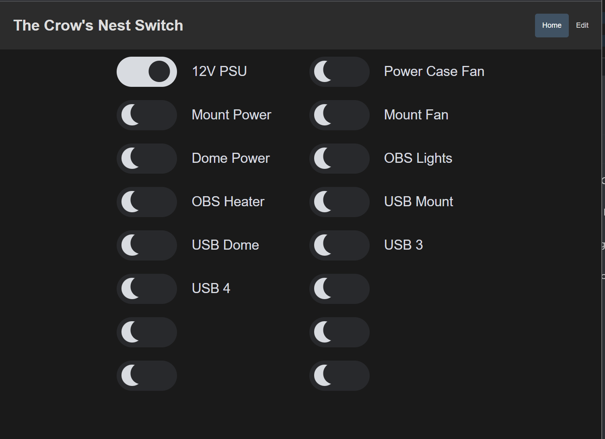
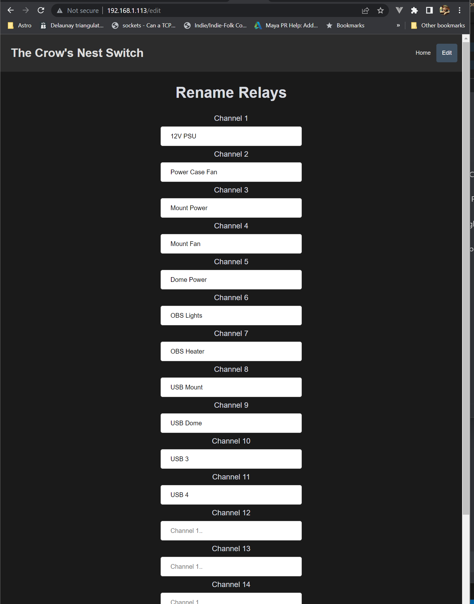
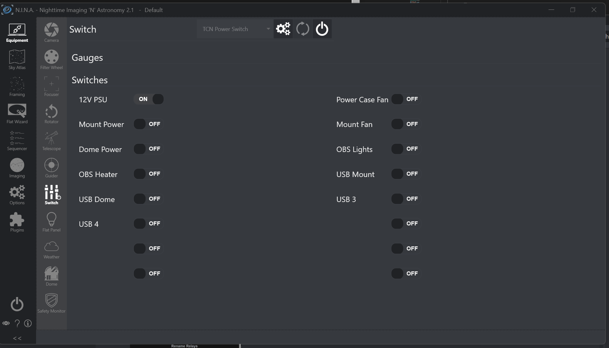

# TCN ASCOM Alpaca Switch

### Description
ASCOM Alpaca Client switch. Currently designed around a ESP8266 WIFI 16 Channel Relay Module ESP-12F board. [AliExpress](https://www.aliexpress.com/item/1005003297328162.html)


### How to
- Clone the repository
- Make nessesary changes to <b>configuration.hpp</b> and <b>arduino_secrets.h</b> files.
- If you have Alpaca Discovery active the client should show up

Create a file called `arduino_secrets.h`in the `src`directory, add your SSID and Password. There's also an option to have a REDIS client configured.

```
#ifndef ARDUINO_SECRETS_H
#define ARDUINO_SECRETS_H

#define _SSID ""
#define _PASSWORD ""
#define _HOSTNAME "TCNSwitch"

#define REDIS_ADDR ""
#define REDIS_PORT 6379
#define REDIS_PASSWORD ""

#endif
```

Web UI



Rename


N.I.N.A

